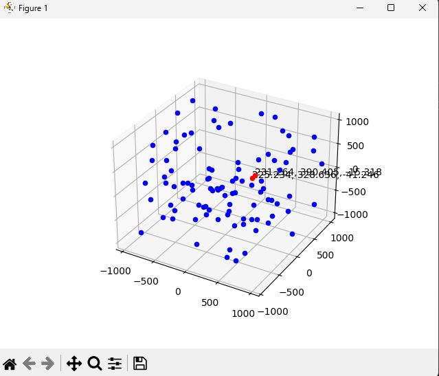

# Tucil 2 Strategi Algoritma

Pencarian sepasang titik terdekat dengan Algoritma _Divide and Conquer_ dalam bahasa Python

## Pasangan Titik Terdekat 3D dengan Algoritma Divide and Conquer

> Program ini dibuat untuk mencari pasangan titik _random_ terdekat pada n-dimensi dengan menggunakan algoritma _divide and conquer_

## Table of Contents

- [Tucil 2 Strategi Algoritma](#tucil-2-strategi-algoritma)
  - [Pasangan Titik Terdekat 3D dengan Algoritma Divide and Conquer](#pasangan-titik-terdekat-3d-dengan-algoritma-divide-and-conquer)
  - [Table of Contents](#table-of-contents)
  - [Setup](#setup)
  - [Usage](#usage)
  - [Project Status](#project-status)

## Setup

Program membutuhkan python dengan library yang ada pada file requirements.txt

Menginstall requirement dapat dilakukan dengan

```bash
pip install -r requirements.txt
```

## Usage

Cara menjalankan program

1. Clone repository

   ```bash
   git clone https://github.com/yansans/Tucil2_13521110_13521120.git
   ```

2. Masuk ke root folder program

   ```bash
   cd Tucil2_13521110_13521120
   ```

3. Menjalankan program

   ```bash
   python src/main.py
   ```

Pemakaian program

1. Menu pertama

    ```bash
    Welcome to the nearest pair point program
    Press enter to continue...
    ```

2. Prompt untuk menerima input user

    ```bash
    Enter the dimension of the points: 
    > 3
    Enter the number of points: 
    > 100
    Enter the rounding of the points(ketelitian angka dibelakang koma): 
    > 3
    Enter the sorting method
    1. Merge sort(default)
    2. Quick sort
    : > 1
    ```

3. Output hasil

    ```bash
    Result with divide and conquer:
    23.825883865 ms
    (-194.229; -214.913; 840.767)
    (-198.687; -213.23; 848.886)
    Distance: 9.414054068
    Number of euclidian operation: 1185

    Result with brute force:
    591.631174088 ms
    (-198.687; -213.23; 848.886)
    (-194.229; -214.913; 840.767)
    Distance: 9.414054068
    Number of euclidian operation: 499500

    Do you want to visualize the result? (y/n):
    y
    ```

    Visualisasi hasil
    

## Project Status

 Disusun Oleh :

- 13521110 Yanuar Sano Nur Rasyid  
- 13521220 Febryan Arota Hia

Project is: _complete_

| Poin                                                  |  Ya | Tidak  |
| -----------                                           | ----|  ----  |
| 1. Program berhasil dikompilasi tanpa kesalahan                                                | ✓  |        |
| 2. Program berhasil running                            | ✓  |        |
| 3. Program dapat menerima masukan dan dan menuliskan luaran                                                   | ✓ |         |
| 4. Luaran program sudah benar (solusi closest pair benar)                                                   | ✓ |         |
| 5. Bonus 1 dikerjakan                                  | ✓ |         |
| 6. Bonus 2 dikerjakan                                  | ✓ |         |

<!-- Optional -->
<!-- ## License -->
<!-- This project is open source and available under the [... License](). -->

<!-- You don't have to include all sections - just the one's relevant to your project -->
